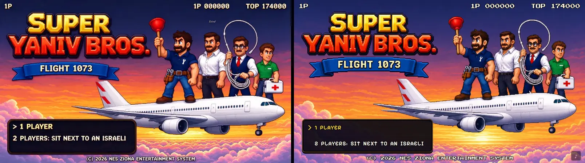

# Fidelity: title

Reference: `art/reference/title.webp` · gate 8/10

| run | palette | composition | rubric | scores | top fixes |
|---|---|---|---|---|---|
| 2026-10-03T21:55 | 0.679 | 0.851 | 8.8 | palette 9, composition 9, characters 9, elements 9, hud 8, style 9 | Remove the extra music-note button in the bottom-right; it is not in the reference title screen.; Fix the copyright line to match the reference exactly, including the studio name and clearer '(C)' text.; Menu text should match spacing more closely: reference reads '> 1 PLAYER' with a clearer gap after the arrow, while the game reads tighter as '> 1PLAYER'. |
| 2026-10-03T21:55 | 0.731 | 0.851 | 8.8 | palette 9, composition 9, characters 9, elements 9, hud 8, style 9 | Remove the extra music-note button at bottom-right; it is not in the reference title screen.; Tighten the menu text layout: second option should fit more comfortably inside the box with less excessive letter spacing and closer to the reference line height.; Move the logo/banner group a few pixels higher and slightly left to better match the reference top-left placement. |
| 2026-10-03T22:02 | 0.731 | 0.851 | – | – | – |
| 2026-10-03T22:12 | 0.732 | 0.849 | – | – | – |
| 2026-10-04T03:58 | 0.731 | 0.849 | – | – | – |
| 2026-10-04T06:56 | 0.731 | 0.849 | 8.8 | palette 9, composition 9, characters 9, elements 9, hud 8, style 9 | Remove the bottom-right music-note overlay; it is not in the reference title screen and reads like an off-HUD mobile control.; Move the second menu line up and reduce the extra vertical gap so the two options match the reference menu spacing.; Copyright line should read as a single '(C) 2026 NES ZIONA ENTERTAINMENT SYSTEM' and sit cleanly centered at the bottom, not cramped against the edge. |
