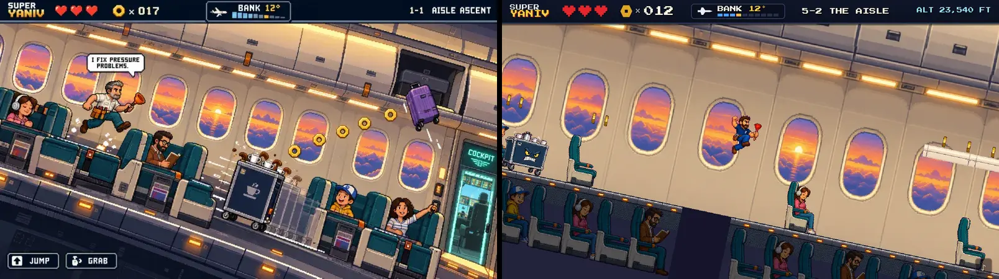

# Fidelity: w5-aisle

Reference: `art/reference/w5-aisle.webp` · gate 5/10

| run | palette | composition | rubric | scores | top fixes |
|---|---|---|---|---|---|
| 2026-10-04T05:58 | 0.657 | 0.092 | 8.0 | palette 8, composition 7, characters 8, elements 8, hud 8, style 9 | Reduce the large empty beige wall area by moving seats, passengers, and the Trolley Troll cart higher into the play space so the aisle feels as busy as the reference.; Place the Trolley Troll drink cart more centrally and fully on-screen, rolling from behind Yaniv rather than cropped at the far left.; Add more overhead-bin detail and small brass hex nuts along the flight path to match the reference density. |
| 2026-10-04T06:57 | 0.648 | 0.092 | 7.3 | palette 8, composition 7, characters 7, elements 6, hud 8, style 8 | Add the Trolley Troll drink cart rolling in from behind Yaniv; this is the biggest missing scene read from the reference.; Reframe/zoom so the aisle foreground is fuller: more teal seat rows and passengers should occupy the lower half instead of the large empty wall area.; Make Yaniv’s brown tool belt and red plunger more readable at sprite size; the plunger reads, but the belt/details are getting lost. |
| 2026-10-04T06:57 | 0.641 | 0.180 | 7.2 | palette 8, composition 6, characters 7, elements 6, hud 8, style 8 | Add the Trolley Troll drink cart rolling in from the right/behind; it is the biggest missing read from the reference scene.; Zoom or frame lower so the aisle, teal seat rows, passengers, and floor path occupy more of the screen instead of mostly empty cabin wall.; Restore more foreground cabin props: seat backs, dividers, orange floor lights, and brass hex nuts along the player path. |
| 2026-10-04T06:58 | 0.662 | 0.185 | 7.2 | palette 8, composition 6, characters 6, elements 7, hud 8, style 8 | Make the Trolley Troll drink cart a clear mid-screen threat rolling in from behind Yaniv; it is currently only barely cropped at the far left and does not read as the featured enemy.; Put Yaniv in a running pose with his navy polo, brown tool belt, and red plunger clearly visible; the current jumping sprite is readable but less on-model and less like the reference action.; Lower and tighten the camera framing so the aisle/seats fill more of the screen; the current shot has too much empty cabin wall and loses the dense side-scrolling composition of the reference. |
| 2026-10-04T09:17 | 0.653 | 0.179 | – | – | – |
| 2026-10-04T09:17 | 0.654 | 0.163 | 7.0 | palette 8, composition 6, characters 7, elements 6, hud 8, style 7 | Add the Trolley Troll drink cart rolling in from behind Yaniv; it is the main missing threat and should occupy the center aisle like the reference.; Make Yaniv larger and more on-model: navy polo, brown tool belt, clear red plunger silhouette, running pose instead of a small falling/jumping read.; Reduce the empty beige wall space by bringing back more seat rows, passengers, and aisle foreground details so the cabin feels as dense as the reference. |
