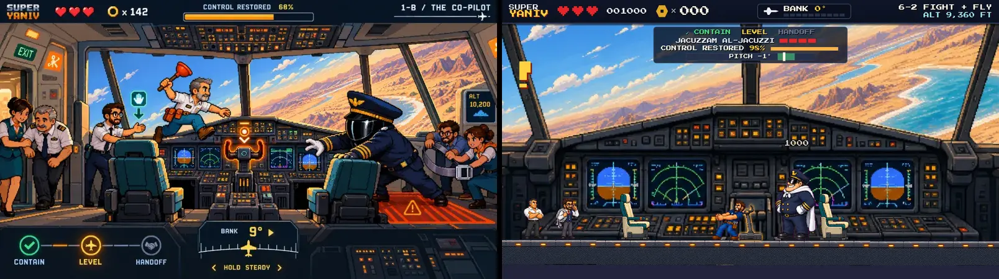

# Fidelity: w6-cockpit

Reference: `art/reference/w6-cockpit.webp` · gate 5/10

| run | palette | composition | rubric | scores | top fixes |
|---|---|---|---|---|---|
| 2026-10-04T13:25 | 0.689 | 0.288 | 7.0 | palette 8, composition 6, characters 7, elements 7, hud 6, style 8 | Restore the reference cockpit depth: add the overhead panel across the top and bring back two large teal pilot seats in the foreground framing the central yoke.; Stage Yaniv at the center yoke with the red plunger clearly visible and a more action-ready pose; current seated pose reads calmer than the boss-fight concept.; Move Jacuzzam farther right near/behind the right pilot seat and make him more threatening, with darker uniform, goggles/visor, and cap closer to the reference. |
